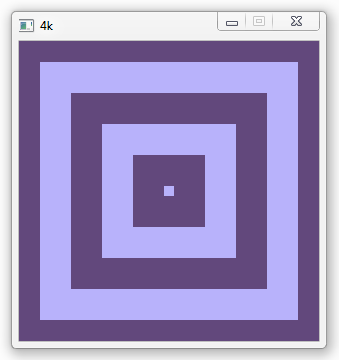

## About

This repository is just like the main [4k][] repository, except that it includes
a simple effect. It can be used to easily test different game loop
implementations or as a general test for 4k.

It's basically the smallest thing I could think of, an infinite
animation of rectangles expanding towards the edges of the screen.
It should look like this:

[4k]: https://github.com/Beluki/4k

## Status

This program is finished!

4k-Example is feature-complete and has no known bugs. Unless issues are reported
I plan no further development on it other than maintenance.

